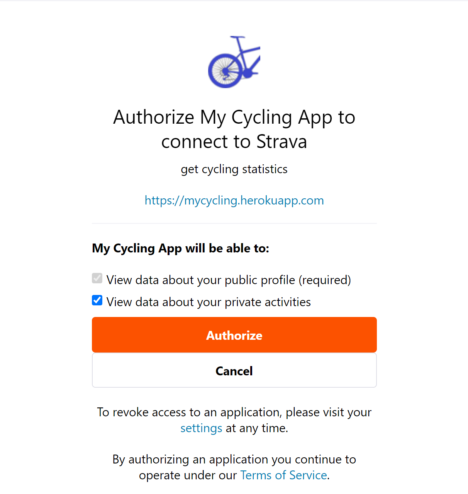

# mycycling

Olisiko niin että kun backend hakee datan stravas API:sta niin  se talletetaan mongoon niin
siitä tai prosessin vaiheista informoidaan useria (admin) socket.io: kautta, vaikkajokin spinning juttu kenties x/x
Estettävä käyttäjältä muut aktionit eli vaikka modal dialog tms.

x