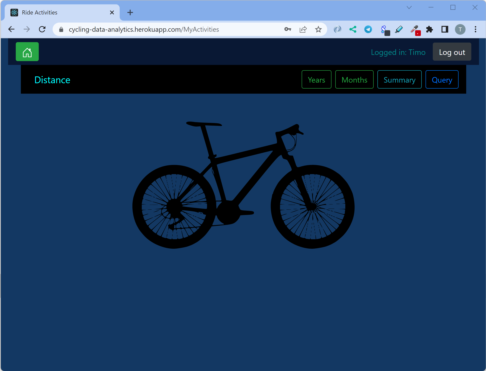
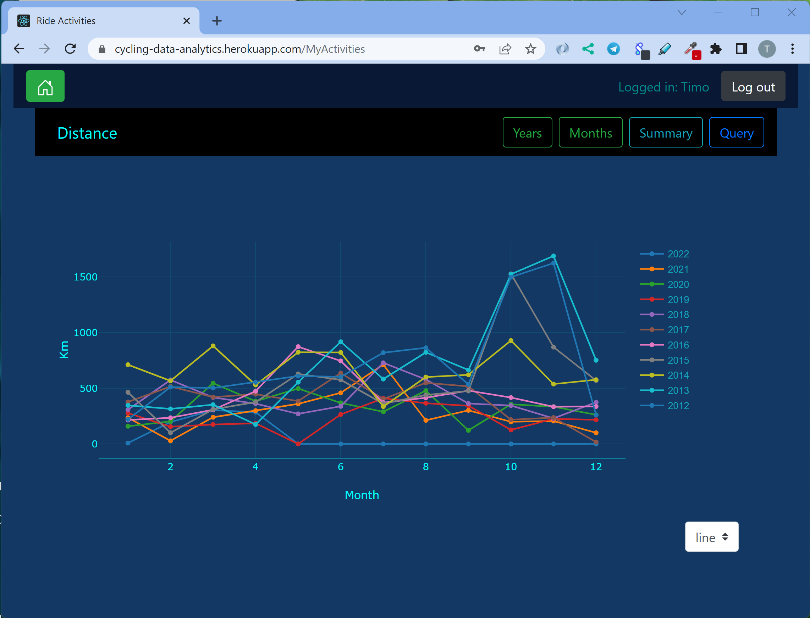

FullStack-ohjelmointi: Harjoitustyö

30.04.2022

Laakkonen Timo AA4598

### Pyöräilyaktiviteettien data-analytiikka.

**Julkaisu:** sovellus toimii Heroku-palvelussa osoitteessa:

https://cycling-data-analytics.herokuapp.com/

**Video:**

https://web.microsoftstream.com/video/04f4c5b0-3ae9-4b82-91ae-504bf08749b8

**Lähdekoodi:**

https://gitlab.labranet.jamk.fi/AA4598/fullstackht

### 1. Yleisesittely

#### Sovelluksen idea

Pyöräilyaktivitettien data-analytiikka.
On olemassa tietoja/yhteenvetoja/vertailuja, joita haluaisi tietää ja joita 
Strava-palvelun ilmainen versio ei myöskään kerro.
Dataa on melko paljon, joten sitä pitää louhia/filtteröidä tarpeen mukaan. 
Tässä harjoitustyässä visuaalisen data-analyysin suhteen rajoitutaan distance-suureeseen.
Jatkokehitysosiossa on selvitetty asiaa.    

#### Toiminnallisuus lyhyesti
Admin-oikeuksilla voidaan päivittää tietokantaa niin, että backend ottaa yhteyden Strava-API-rajapintaan ja tallentaa uusimman datan mongoDb-tietokantaan

Sovellus avautuu aluksi etusivu-näkymään. 

##### Kirjautuminen
Kun käyttäjä painaa "Kirjaudu"-painiketta avautuu modaalinen dialogi, johon syötetääm kirjautumista varten sähköpostiosoite ja salasana.        

##### Rekisteröityminen
Jos käyttäjällä ei vielä ole tunnuksia voi hän rekisteröityä painamalla kirjautumislomakkeella olevaa "Rekisteröidy"-painiketta, jolloin avautuu rekisteröintilomake. Rekisteröinnin yhteydessä kysytään etunimi, sukunimi, sähköpostiosoite, salasana sekä ruksattava tieto onko admin (itseasiassa todellisessa versiossa ei kysytä admin tietoa, se ei ole valinnainen).      

Kun on kirjauduttu onnistuneesti    

#### Valinnat/toiminnat

##### Years
Näytetään vuosikohtaiset kilometrimäärät koko historian ajalta    

##### Months
Näytetään valitun vuoden kilometrimäärät kuukausi tasolla      

###### Summary
Näytetään kilometrimäärät kuukausi tasolla eri vuois koko historian ajalta    

##### Query
Haetaan aktivitettien tietoja valitulta aikajaksolta.    

Jos kirjautunut käyttäjä on admin, on hänellä navigointipalkissa "myactivities"-painikkeen lisäksi painike tietokannan päivitystä varten.    

## 2. Kuvaus teknologioista

### Lyhyehkö kuvaus eri teknologioiden käyttämisestä

Työssä toteutettu fullstack on MERN-stack.

Backend on toteutettu Node.js:n päällä toimivaa Express-kirjastoa käyttämällä.

Tietokanta on MongoDB-palvelussa, kannan tyyppi on NoSQL.
MongoDB-tietokannan käsittelyyn käytetään Mongoose-kirjaston metodeja.

Frontend on SPA-sovellus, joka on toteutettu Reactilla.     
Käyttöliittymän muotoilu on toteutettu  React-Bootstrapilla     
sekä datan visualisointi Plotly-grafiikkakirjastolla.    

Backendin ja frontendin väliseen kommunikointiin on käytetty socket.io -kirjastoa.     
Backend ilmoittaa frontendille koska tietokannan päivitys alkoi ja koska se loppui,       
näin frontedilla näytetään odotustila ja käyttöliittymän käyttö on estetty em. päivitysprosessin aikana.

Sovelluksen käyttö vaatii rekisteröinnin ja kirjautumisen. Autentikointi on toteutettu token-perusteisesti.    
Tokenit ovat JSON Web Token (JWT) -muotoisia tokeneja. Kaikki palvelupyynnät backendiin vaativat token-tunnistautumisen.      

Jotta tietokanta voidaan päivittää, tarvitaan admin-oikeudet. Token sisältää tällöin myös tämän tiedon ja se tarkistetaan myös      backendin päässä, jotta päästään päivittämistä ohjaavaan express-routeen. Frontendissä kutsu backendiin on mahdollista vain admin-oikeuksilla kyseisen painikkeen ollessa käytetävissä/näkyvissä.  

##### Käytetyt kirjastot (package.json)
###### Backend
*    "axios": "^0.26.1", HTTP-client
*    "bcrypt": "^5.0.1", salasanan kryptaamiseen
*    "bcryptjs": "^2.4.3",  salasanan kryptaamiseen
*    "cors": "^2.8.5", Cross-Origin Resource Sharing (CORS) 
*    "dotenv": "^8.2.0", ympäristömuuttujien tallentamiseen/lukemiseen
*    "express": "^4.17.1", Node.js pohjainen palvelin-sovelluskehys
*    "express-jwt": "^5.3.3", tokenin validointiin
*    "express-validator": "^6.10.1", validointiin
*    "jsonwebtoken": "^8.5.1", tokenin käsittelyyn
*    "mongoose": "^5.12.6", mongoDb:een käsittelyyn
*    "mongoose-unique-validator": "^2.0.3", mongoDB scheman validointiin
*    "socket.io": "^4.4.1", backendin ja frontendin väliseen viestintään  
###### Frontend  
*    "axios": "^0.21.1", HTTP-client
*    "bootstrap": "^4.6.0", käyttöliittymäkomponentti-kirjasto
*    "danfojs": "^1.0.4", Pandas-tyyppinen kirjasto tietojen käsittelyä ja analysointia varten
*    "plotly.js": "^2.11.1", datan visualisointi grafiikka/kuvaajat
*    "react": "^17.0.2",
*    "react-bootstrap": "^1.6.4", käyttöliittymäkomponentti-kirjasto
*    "react-bootstrap-icons": "^1.8.1", käyttöliittymäkomponentti-kirjastoon liittyvät ikonit
*    "react-datepicker": "^4.7.0", päivämäärän valitsin
*    "react-dom": "^17.0.2", React-ovelluskehykseen liittyvä
*    "react-plotly.js": "^2.5.1",
*    "react-router-bootstrap": "^0.26.1", liittyy SPA Routeriin
*    "react-router-dom": "^6.3.0", liittyy SPA Routeriin 
*    "react-scripts": "^4.0.3",  Reactiin liittyvää koodia
*    "socket.io-client": "^4.4.1", frontendin ja backendin väliseen viestintään 
 

#### Komennot, joilla kehitysversion saa Githubista omalle koneelle toimimaan

Projekti saadaan kopioitua omalle koneelle komennolla:      
`git clone https://gitlab.labranet.jamk.fi/AA4598/fullstackht.git`

node_modules pitää asentaa backendin juuressa komennolla:       
`nmp i`     
palvelin käyntiin backendin juuresta komennolla:        
`nmp start`     

node_modules pitää asentaa frontendin juuressa komennolla:      
`nmp i`     
client käyntiin frontendin juuresta komennolla:     
`nmp start`     
sovellus käynnistyy selaimen osoitteeseen http://localhost:3000/        

### Jakokehitys/kehitettävää
Sovellukseen on kohtalaisella vaivalla lisättävissä ominaisuuksia ja toimintoja.    
Muidenkin tietojen kuten "Moving time", "Avg speed", "Avg hr" visuaalinen esitys toiminnoissa Years, Months, Summary.   
Rekisteröinnin yhteydessä voitaisiin kysyä käyttäjän Strava API-rajapinnan clientId, clientSecret ja refreshToken,      
jotka saadaan kun noudatetaan ohjeita https://developers.strava.com/docs/getting-started/     
Näin sovelluksessa olisi nähtävissä/käytettävissä myös muidenkin käyttäjien aktiviteettejä ja käyttäjä itse näkisi omiaan.         
Nyt sovelluksen data ja analytiikka pohjautuu itseni suorituksiin.      

Esim. seuraavat tiedot on helposti selvitettävissä:       
* paljonko oli suorituksia yhteensä?
* mikä oli keskimääräinen (keskiarvo) suorituksen matkan pituus?
* mikä oli keskimääräinen pulssi
* mikä oli korkein suoritusten keskimääräinen pulssi
    * ja milloin tämä oli, paljonko oli esim. matka ja aika tuolloin?
* mikä oli alin suoritusten keskimääräinen pulssi?
    * ja milloin tämä oli, paljonko oli esim. matka ja aika tuolloin?
* mikä oli suoritusten keskimääräisten nopeuksien keskiarvo?
* mikä oli pisin matka?
* mikä oli ajallisesti pisin suoritus, oliko se myös pisin matkaltaan?
* mikä oli vauhdikkain suoritus km/h ja mikä oli matkan pituus tällöin?
* paljonko kertyi kilometrejä tiettynä vuotena esim. 2015
    * mitkä olivat 10 pisintä suoritusta ko. vuonna