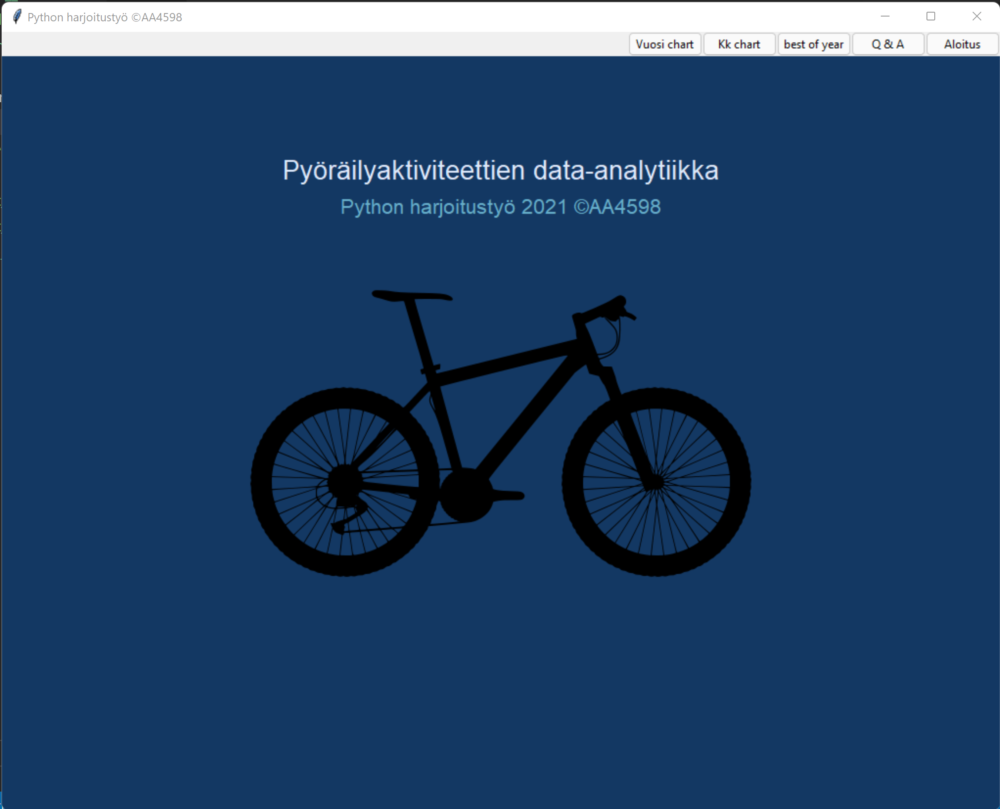
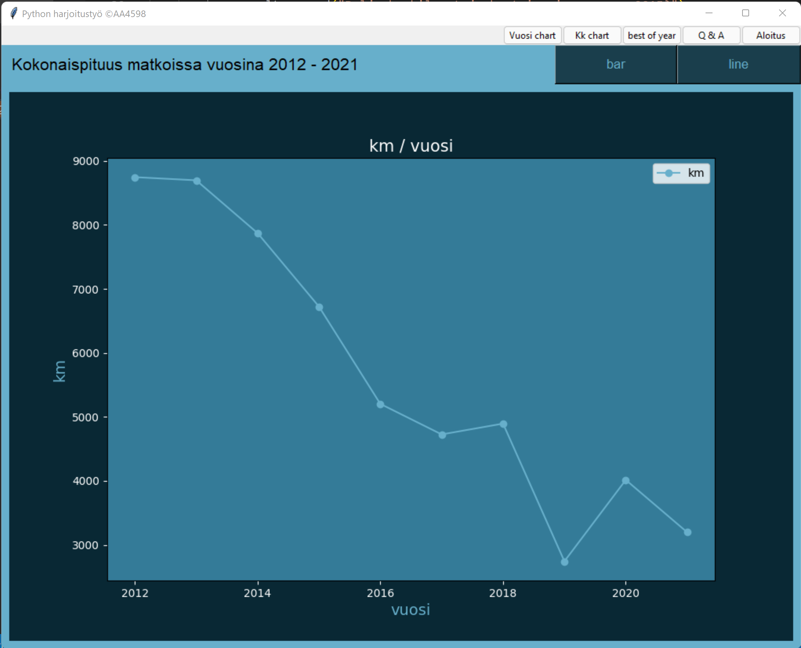
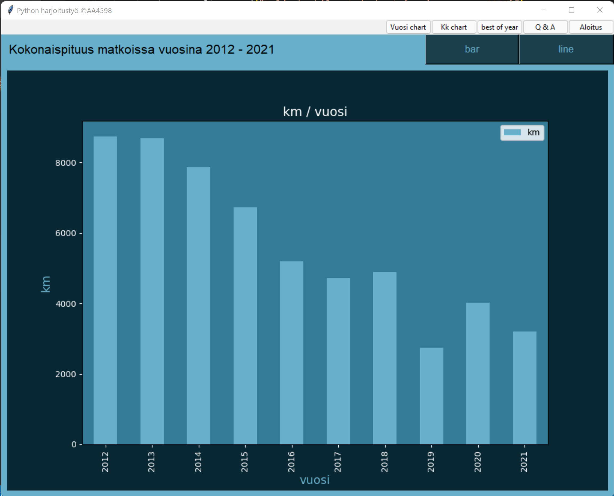
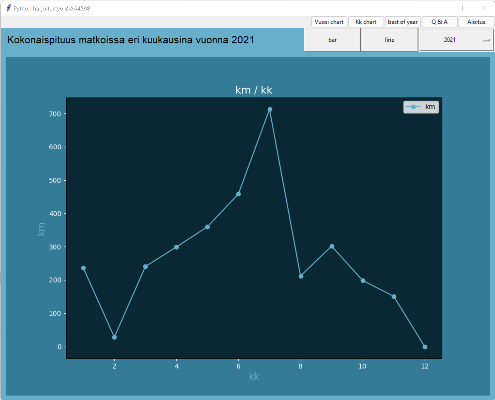
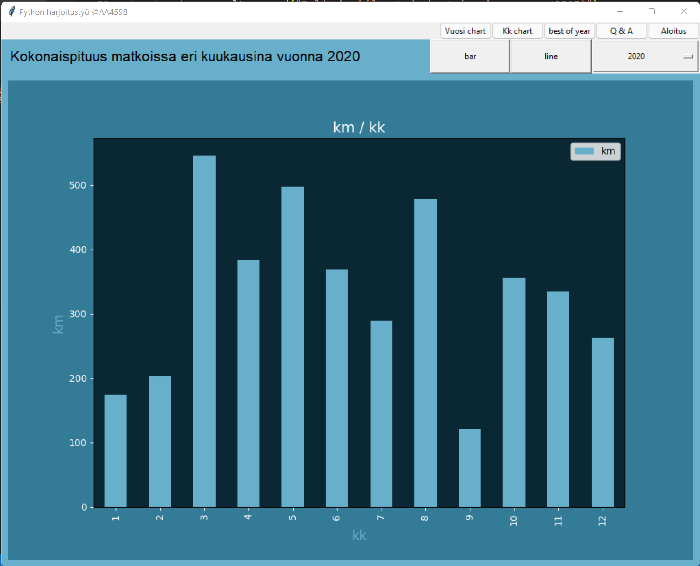
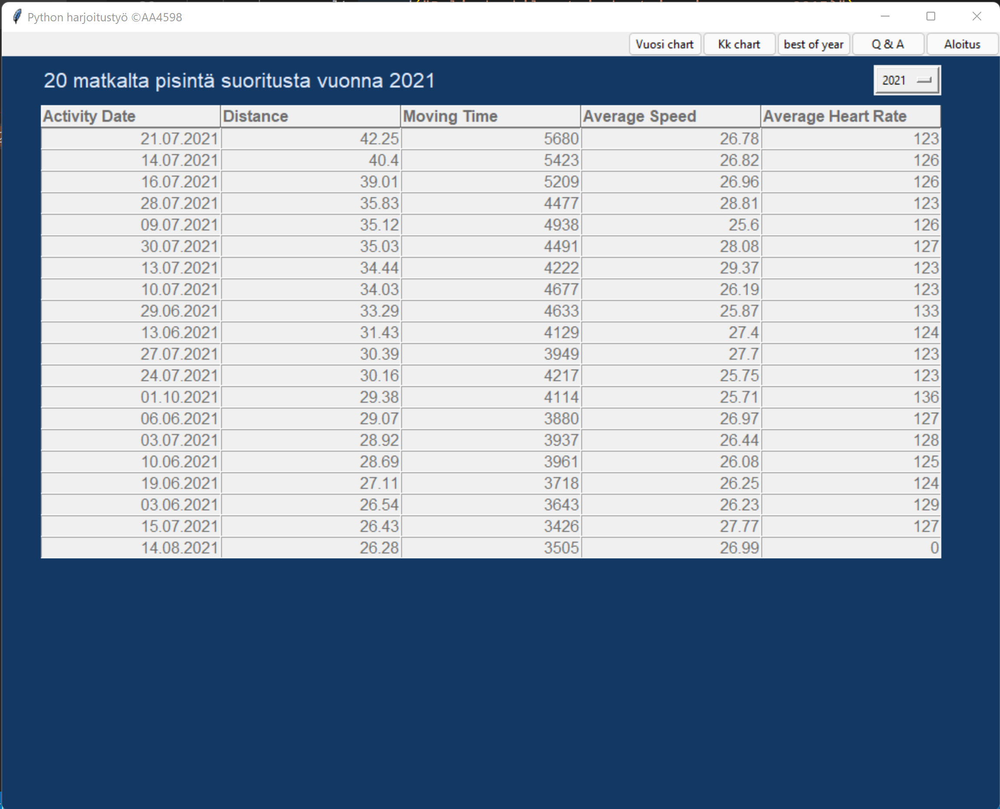
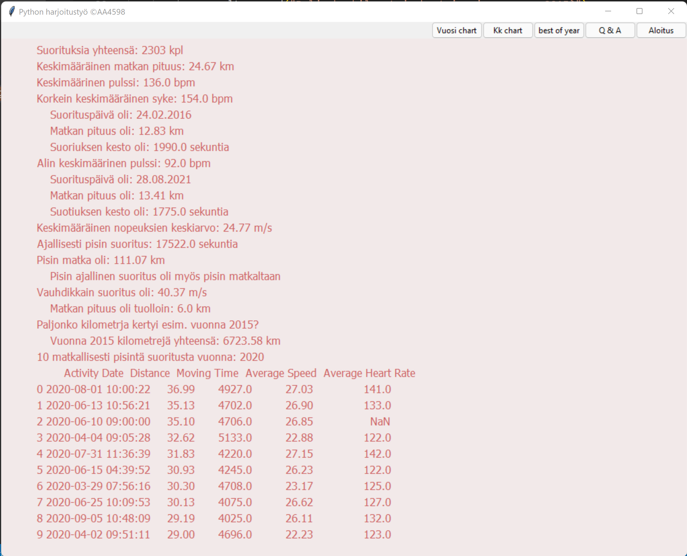

### Pyöräilyaktiviteettien data-analytiikka 

Tehtävää varten tilasin Strava-palvelusta 
(https://www.strava.com/athletes/741808) pyöräilydataani 10 vuoden ajalta. 
Dataa on melko paljon joten sitä pitää louhia/filtteröidä tarpeen mukaan. 
Mitä sitten kiinnostaisi tietää? 
Ja mitä itse Strava-palvelun ilmainen versio ei myöskään kerro?

Selvitettiin seuraavat tiedot:
* paljonko oli suorituksia yhteensä?
* mikä oli keskimääräinen (keskiarvo) suorituksen matkan pituus?
* mikä oli keskimääräinen pulssi
* mikä oli korkein suoritusten keskimääräinen pulssi
    * ja milloin tämä oli, paljonko oli esim. matka ja aika tuolloin?
* mikä oli alin suoritusten keskimääräinen pulssi?
    * ja milloin tämä oli, paljonko oli esim. matka ja aika tuolloin?
* mikä oli suoritusten keskimääräisten nopeuksien keskiarvo?
* mikä oli pisin matka?
* mikä oli ajallisesti pisin suoritus, oliko se myös pisin matkaltaan?
* mikä oli vauhdikkain suoritus km/h ja mikä oli matkan pituus tällöin?
* paljonko kertyi kilometrejä tiettynä vuotena esim. 2015
    * mitkä olivat 10 pisintä suoritusta ko. vuonna

##### Käytetyt kirjastot
* Pandas (data-analytiikka)
* Matplotlib (chart)
* Tkinter (GUI)

##### Data
https://student.labranet.jamk.fi/~AA4598/pythonht/activities.csv

#### Sovelluksen käynnistys 
APP/start.py 

#### Dokumentointi/raportti:
doc/python_ht.docs

Sovelluksen keskeiset osat ovat myös erikseen omina ajettavina sovelluksinaan
* chart/use_chart_month.py
* chart/use_chart_year.py
* table/use_table.py
* Q&A/q&a.py

